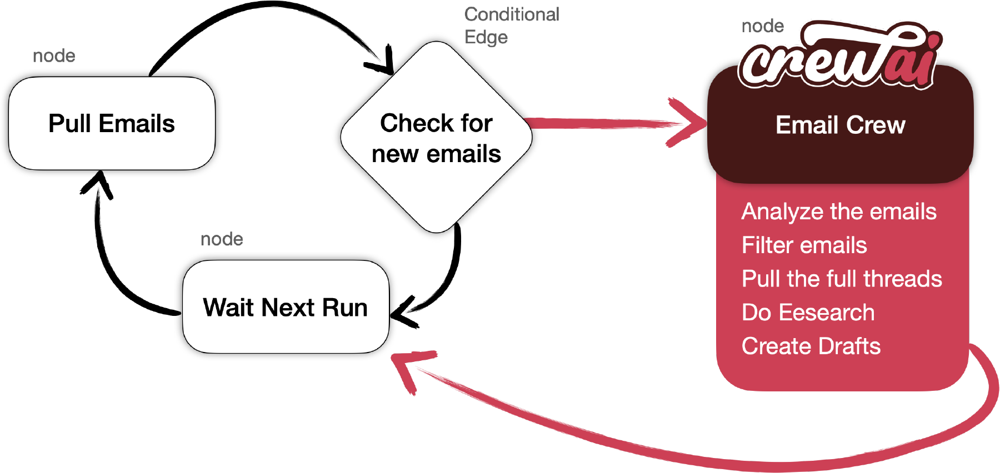

# CrewAI + LangGraph

## Introduction
This is an example of how to use the [CrewAI](https://github.com/joaomdmoura/crewai) with LangChain and LangGraph to automate the process of automatically checking emails and creating drafts. CrewAI orchestrates autonomous AI agents, enabling them to collaborate and execute complex tasks efficiently.

By [@joaomdmoura](https://x.com/joaomdmoura)

- [CrewAI Framework](#crewai-framework)
- [Running the code](#running-the-code)
- [Details & Explanation](#details--explanation)
- [Using Local Models with Ollama](#using-local-models-with-ollama)
- [License](#license)

## CrewAI Framework
CrewAI is designed to facilitate the collaboration of role-playing AI agents. In this example, these agents work together to give a complete stock analysis and investment recommendation

## Running the Code
This example uses GPT-4.

- **Configure Environment**: Copy ``.env.example` and set up the environment variable
- **Setup a credentials.json**: Follow the [google instructions](https://developers.google.com/gmail/api/quickstart/python#authorize_credentials_for_a_desktop_application), once you’ve downloaded the file, name it `credentials.json` and add to the root of the project,
- **Install Dependencies**: Run `pip install -r requirements.txt`
- **Execute the Script**: Run `python main.py`

## Details & Explanation
- **Running the Script**: Execute `python main.py`
- **Key Components**:
	- `./src/graph.py`: Class defining the nodes and edges.
	- `./src/nodes.py`: Class with the function for each node.
	- `./src/state.py`: State declaration.
	- `./src/crew/agents.py`: Class defining the CrewAI Agents.
	- `./src/crew/taks.py`: Class definig the CrewAI Tasks.
	- `./src/crew/crew.py`: Class defining the CrewAI Crew.
	- `./src/crew/tools.py`: Class implementing the GmailDraft Tool.

## License
This project is released under the MIT License.
