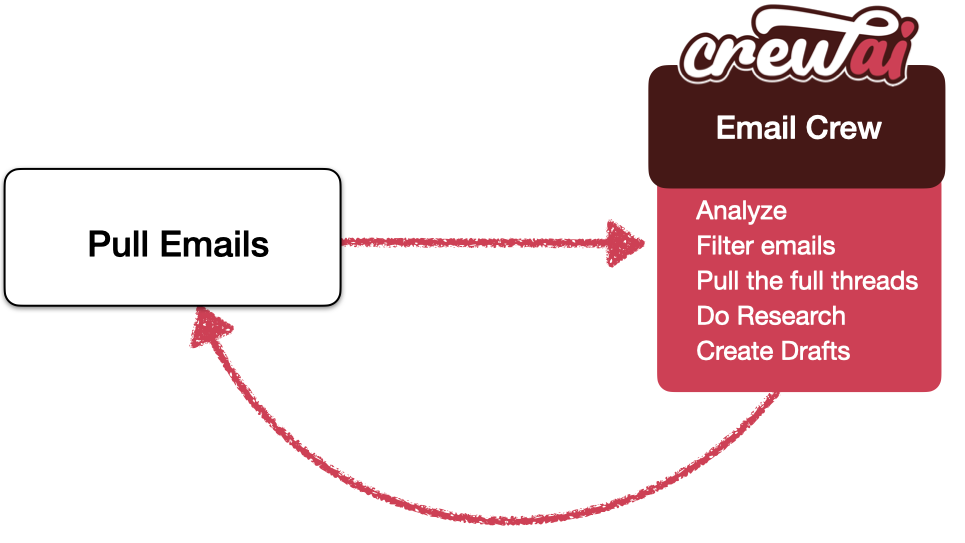

# Email Auto Responder Flow

## Introduction

Welcome to the Email Auto Responder Flow project, powered by [crewAI](https://crewai.com). This example demonstrates how you can leverage Flows from crewAI to accomplish tasks that previously required LangGraph. By utilizing Flows, the process becomes much simpler and more efficient.

In this project, we've taken one of our old example repositories, [CrewAI-LangGraph](https://github.com/crewAIInc/crewAI-examples/tree/main/CrewAI-LangGraph), and repurposed it to now use Flows. This showcases the power and simplicity of Flows in orchestrating AI agents to automate tasks like checking emails and creating drafts.

- [CrewAI Framework](#crewai-framework)
- [Running the Code](#running-the-code)
- [Details & Explanation](#details--explanation)
- [License](#license)

## CrewAI Framework

CrewAI is designed to facilitate the collaboration of role-playing AI agents. In this example, these agents work together using Flows to automatically check emails and create draft responses. Flows simplify the orchestration process, making it more straightforward than previous implementations with LangGraph.

## Running the Code

This example uses GPT-4o.

- **Configure Environment**: Copy `.env.example` to `.env` and set up your environment variables, including your `OPENAI_API_KEY`.
- **Setup a `credentials.json`**: Follow the [Google Gmail API instructions](https://developers.google.com/gmail/api/quickstart/python#authorize_credentials_for_a_desktop_application). Once you’ve downloaded the file, name it `credentials.json` and add it to the root of the project.
- **Install Dependencies**: Run `poetry install`
- **Execute the Script**: First open the new shell with the poetry environment by running `poetry shell`. Then run `crewai run`.

## Details & Explanation

- **Key Components**:
  - `./src/email_auto_responder_flow/main.py`: Main script that initiates the flow.
  - `./src/email_auto_responder_flow/crews/email_filter_crew/`: Contains the crew definition using Flows.
  - `./src/email_auto_responder_flow/utils/`: Utility functions for email processing.
  - `./src/email_auto_responder_flow/types.py`: Defines the data models used in the project.

## License

This project is released under the MIT License.
