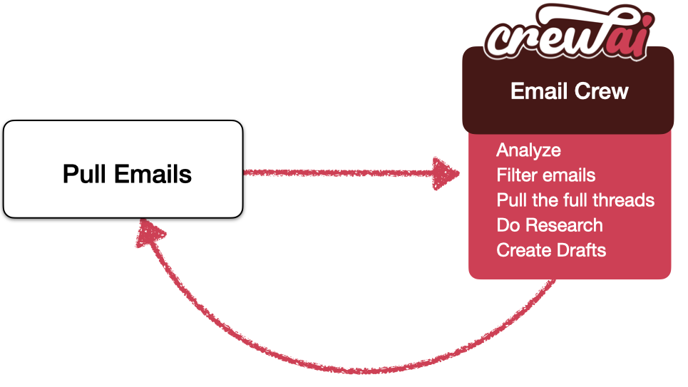

# Email Auto Responder Flow

Welcome to the Email Auto Responder Flow project, powered by [crewAI](https://crewai.com). This example demonstrates how you can leverage Flows from crewAI to automate the process of checking emails and creating draft responses. By utilizing Flows, the process becomes much simpler and more efficient.

## Background

In this project, we've taken one of our old example repositories, [CrewAI-LangGraph](https://github.com/crewAIInc/crewAI-examples/tree/main/CrewAI-LangGraph), and repurposed it to now use Flows. This showcases the power and simplicity of Flows in orchestrating AI agents to automate tasks like checking emails and creating drafts. Flows provide a more straightforward and powerful alternative to LangGraph, making it easier to build and manage complex workflows.

### High-Level Diagram

Below is a high-level diagram of the Email Auto Responder Flow:



This diagram illustrates the flow of tasks from fetching new emails to generating draft responses.

## Overview

This flow will guide you through the process of setting up an automated email responder. Here's a brief overview of what will happen in this flow:

1. **Fetch New Emails**: The flow starts by using the `EmailFilterCrew` to check for new emails. It updates the state with any new emails and their IDs.

2. **Generate Draft Responses**: Once new emails are fetched, the flow formats these emails and uses the `EmailFilterCrew` to generate draft responses for each email.

This flow is a great example of using Flows as a background worker that runs continuously to help you out. By following this flow, you can efficiently automate the process of checking emails and generating draft responses, leveraging the power of multiple AI agents to handle different aspects of the email processing workflow.

## Installation

Ensure you have Python >=3.10 <=3.13 installed on your system. First, if you haven't already, install CrewAI:

```bash
pip install crewai==0.130.0
```

Next, navigate to your project directory and install the dependencies:

1. First lock the dependencies and then install them:

```bash
crewai install
```

### Customizing & Dependencies

**Add your `OPENAI_API_KEY` into the `.env` file**  
**Add your `SERPER_API_KEY` into the `.env` file**  
**Add your `TAVILY_API_KEY` into the `.env` file**  
**Add your `MY_EMAIL` into the `.env` file**

To customize the behavior of the email auto responder, you can update the agents and tasks defined in the `EmailFilterCrew`. If you want to adjust the flow itself, you will need to modify the flow in `main.py`.

- **Agents and Tasks**: Modify `src/email_auto_responder_flow/crews/email_filter_crew/email_filter_crew.py` to define your agents and tasks. This is where you can customize how emails are filtered and how draft responses are generated.

- **Flow Adjustments**: Modify `src/email_auto_responder_flow/main.py` to adjust the flow. This is where you can change how the flow orchestrates the different crews and tasks.

### Setting Up Google Credentials

To enable the email auto responder to access your Gmail account, you need to set up a `credentials.json` file. Follow these steps:

1. **Set Up Google Account**: Follow the [Google instructions](https://developers.google.com/gmail/api/quickstart/python#authorize_credentials_for_a_desktop_application) to set up your Google account and obtain the `credentials.json` file.

2. **Download and Place `credentials.json`**: Once you’ve downloaded the file, name it `credentials.json` and place it in the root of the project.

## Running the Project

To kickstart your crew of AI agents and begin task execution, run this from the root folder of your project:

```bash
uv run kickoff
```

This command initializes the email_auto_responder_flow, assembling the agents and assigning them tasks as defined in your configuration.

When you kickstart the flow, it will orchestrate multiple crews to perform the tasks. The flow will first fetch new emails, then create and run a crew to generate draft responses.

## Understanding Your Flow

The email_auto_responder_flow is composed of multiple AI agents, each with unique roles, goals, and tools. These agents collaborate on a series of tasks, defined in `config/tasks.yaml`, leveraging their collective skills to achieve complex objectives. The `config/agents.yaml` file outlines the capabilities and configurations of each agent in your flow.

### Flow Structure

1. **EmailFilterCrew**: This crew is responsible for checking for new emails and updating the state with any new emails and their IDs.

2. **Generate Draft Responses**: Once new emails are fetched, this step formats the emails and uses the `EmailFilterCrew` to generate draft responses for each email.

By understanding the flow structure, you can see how multiple crews are orchestrated to work together, each handling a specific part of the email processing workflow. This modular approach allows for efficient and scalable email automation.

## Support

For support, questions, or feedback regarding the Email Auto Responder Flow or crewAI:

- Visit our [documentation](https://docs.crewai.com)
- Reach out to us through our [GitHub repository](https://github.com/joaomdmoura/crewai)
- [Join our Discord](https://discord.com/invite/X4JWnZnxPb)
- [Chat with our docs](https://chatg.pt/DWjSBZn)

Let's create wonders together with the power and simplicity of crewAI.
